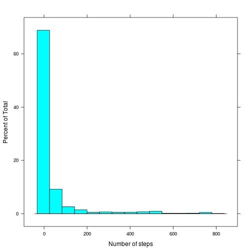
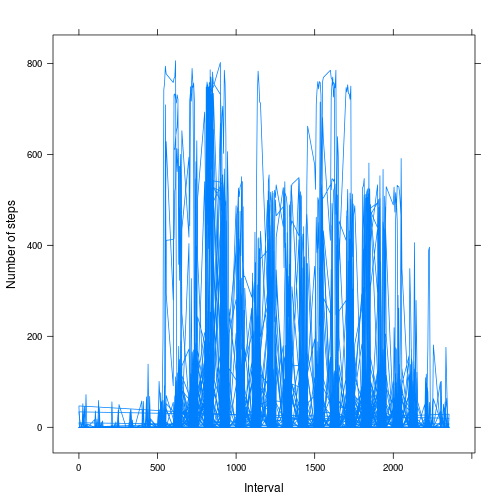
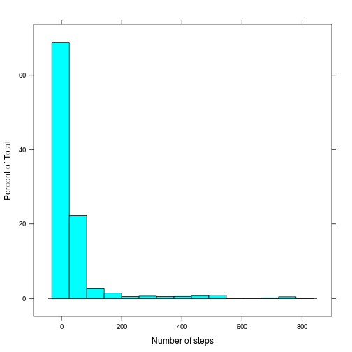
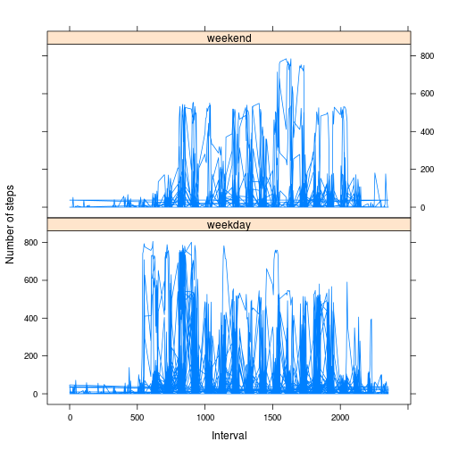

# Reproducible Research: Peer Assessment 1


## Loading and preprocessing of the data
The data file is provided as a comma separated file. Thus the R function: `read.csv` was used to read in the data into a variable called *activity*. There was no need for any preprocessing of the data. The code that was used for loading is shown below:


```r
activity <- read.csv("activity.csv")
```


## Mean and median of total number of steps taken per day
The mean number of steps taken per day was 37.38 and the median was 0. A histogram was also drawn. The histogram showed that the number number of steps taken were not normally distributed. See R code below.


```r
# load the lattice library if not yet loaded
library(lattice)
# Draw a histogram of the total number of steps taken each day
histogram(activity$steps, xlab = "Number of steps")
```

 

```r
# mean and median of total number of steps taken per day
mean(activity$steps, na.rm = TRUE)
```

```
## [1] 37.38
```

```r
median(activity$steps, na.rm = TRUE)
```

```
## [1] 0
```


##  Average daily activity pattern
To show the average daily activity pattern, a time series plot of the 5-minute interval (x-axis) and the average number of steps taken, averaged across all days (y-axis) was was generated.


```r
# load the lattice library if not yet loaded
library(lattice)
xyplot(steps ~ interval, type = "l", xlab = "Interval", ylab = "Number of steps", 
    data = activity)
```

 


## Five minutes interval with maximum number of steps
The five minutes interval with maximimum number of steps was: interval 615. The R code below shows how this was identified.


```r
activity$interval[which(activity$steps == max(activity$steps, na.rm = TRUE))]
```

```
## [1] 615
```


## Imputing missing values
It was thought that the presence of missing values in the dataset could introduce bias into some calculations or summaries of the data. This was taken care of by imputing the missing values. The total number of missing values were .  After creating a new dataset from the original set, inspection of the new data set showed that the missing values were only present in the *steps* variable.


```r
# store number of rows of data that have missing values
num.missing <- activity[!complete.cases(activity), ]
# Create a new dataset
new.activity <- activity
# Imput the missing values with mean
new.activity$steps[is.na(new.activity$steps)] <- mean(new.activity$steps, na.rm = TRUE)
```


These were imputed with the mean of total number of steps (see R code below). The mean of the new dataset was 37.38 and the median was 0. Imputing the data with the mean resulted into the same mean number of steps per day, which makes sense logically. The median remains the same at 0. A histogram of the total number  steps was  drawn and showed that the total number of steps was not normally distributed even after the imputing (see R code below).


```r
# load the lattice library if not yet loaded
library(lattice)
# Draw histogram of the total number of steps taken each day for the new
# data
histogram(new.activity$steps, xlab = "Number of steps")
```

 

```r
# mean and median total number of steps taken per day for the new data
mean(new.activity$steps, na.rm = TRUE)
```

```
## [1] 37.38
```

```r
median(new.activity$steps, na.rm = TRUE)
```

```
## [1] 0
```


## Differences in activity patterns between weekdays and weekends
A panel plot comparing the average number of steps taken per 5-minute interval across weekdays and weekends was produced from the imputed data (see R code below for details of how the plot was created). There was no noticable difference  in activity patterns during week days and weekends.


```r
# load the lattice library if not yet loaded
library(lattice)
# convert the 'date' variable in new.activity from type character to type
# date
date <- as.Date(new.activity$date)
# create a loogical variable 'weekday.class'
weekday.class <- weekdays(date)[] == "Saturday" | weekdays(date)[] == "Sunday"
# set values of 'weekday.class' variable to 'weekend' for TRUE values and
# 'weekday' for FALSE values.
weekday.class[weekday.class[] == TRUE] <- "weekend"
weekday.class[weekday.class[] == FALSE] <- "weekday"
# add a new variable, 'weekday.class', as a foctor, to the new.activity
# dataset
new.activity$weekday.class <- factor(weekday.class)
# generate a panel plot
xyplot(steps ~ interval | weekday.class, type = "l", xlab = "Interval", ylab = "Number of steps", 
    layout = c(1, 2), data = new.activity)
```

 

